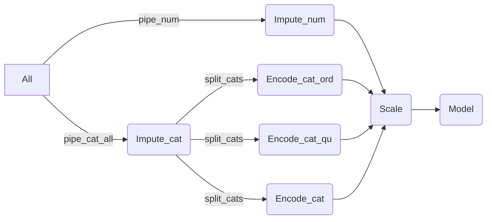

# ML_SupReg
Explore some Regression ML Algos
## Regressor Models
https://scikit-learn.org/stable/supervised_learning.html

### DescisionTreeRegressor
### KNeighbourRegressor

## Regressor Performace
-----

### Residual plot
-----
Residual : differences between the observations and the predicted values
Regression model fits the data well if residuals are small and unbiased. 
Unbiased : fitted values are not systematically too high or too low anywhere in the observation space (No pattern)


Residual plots can expose a biased model far more effectively than the numeric metrics by displaying problematic patterns in the residuals.
https://statisticsbyjim.com/regression/check-residual-plots-regression-analysis/

#### how to
```python
from sklearn.metrics import PredictionErrorDisplay

PredictionErrorDisplay.from_predictions(y_test, y_predict)
PredictionErrorDisplay.from_predictions(y_test, y_predict, kind='actual_vs_predicted')
```

#### Results interprtion


Your independent variables should describe the relationship so thoroughly that only random error remains. Non-random patterns in your residuals signify that your variables are missing something.

### Metrics
--------
#### **MAE (Mean Absolute Error)**
average of absolute residuals


```python
from sklearn.metrics import mean_absolute_error
mae = mean_absolute_error(y_train, y_pred)
```
#### **MSE (Mean Squared Error)**
average of squared residual
unit = (variableUnit)2
Sensitive to outliers


```python
from sklearn.metrics import mean_squared_error
mse = mean_squared_error(y_train, y_pred)
```

#### **RMSE (Root Mean Squared Error)**
root of average of squared residual
unit = variableUnit , hence more relatable

```python
from sklearn.metrics import mean_squared_error
rmse = mean_squared_error(y_train, y_pred, squared=False)
```

#### **MAPE (Mean Absolute Percentage Error)**
Average of absolute of percentage of residual


```python
from sklearn.metrics import mean_absolute_percentage_error
mape = mean_absolute_percentage_error(y_train, y_pred)
```

#### **R² score**
https://statisticsbyjim.com/regression/interpret-r-squared-regression/
the coefficient of determination
represents the proportion of variance (of y) that has been explained by the independent variables in the model.
percentage of the variance in the dependent variable that the independent variables explain collectively
It provides an indication of goodness of fit and therefore a measure of how well unseen samples are likely to be predicted by the model, through the proportion of explained variance.
*1.0* Best  
*0.0* A constant model that always predicts the expected (average) value of y, disregarding the input features.
*-ve* Worst


```python
from sklearn.metrics import r2_score
r2 = r2_score(y_train, y_pred)
```
# Feature Selection


# Overall Pipeline
